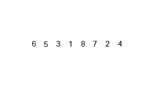

# Sorting Real World Data

In this part of the tutorial, we'll be implementing different sorting algorithms to improve a web app for displaying San Francisco civic data sets.

After you've written a few different ways to sort data, you'll compare and analyze their runtime performance to learn more about how, when, and why to use different types of sorting algorithms.

Much of the starter code (the core web app) is already written for you. Your job is to grok (i.e. understand) the existing code and then improve upon it by adding more sorting algorithms.

> [action]
>
> Create a repo from the starter code [using this link](https://classroom.github.com/assignment-invitations/ed9300da2d3353c63e009e81a364f034). Clone it to your computer, then follow the "Getting Started" instructions in the README to get the app up and running. Once you have it working, explore the codebase to see how it works.

Now that we have the starter code up and running, we can start working on our sorting algorithms.

If you open the `sort.py` file, you'll notice that the `timed_sort()` function accepts an `algorithm` argument for specifying which sorting algorithm to use. At the moment, only one algorithm is available (insertion sort), and so it is set as the default.

# Build Your Own Sorting Routines

Now for the fun part: we're going to build our own implementations of sorting algorithms!

Each sorting function will have the same interface: it will accept a list as its first argument, and a `key` function as its second argument. The `key` function is used to perform some operation on each element in the list before comparison. See the `insertion()` function for an example.

> [action]
>
Implement 5 common sorting algorithms:
>
- bubble
- selection
- heap
- quick
- merge
>
Make sure to rigorously test your implementations to ensure that they work as expected!

<!-- comment to break boxes -->

> [info]
>
There are lots and lots of resources on sorting algorithms on the web. The [Wikipedia article](https://en.wikipedia.org/wiki/Sorting_algorithm) has a good overview and the site [http://www.sorting-algorithms.com/](http://www.sorting-algorithms.com/) includes helpful animations and brief summaries.

# Use Your Routines in the Project Code

Once you have some (well-tested) sorting algorithms written, it is time to make use of them.

After all, a piece of code is only as valuable as its application.

> [action]
>
Instead of using the `insertion()` sort function in `timed_sort()` by default, use one of your own implementations! Try each one in turn and check the runtimes.

It would be nice if the UI (user interface) allowed users to choose a sorting algorithm along with the column to sort by.

> [action]
>
Add an element to the sorting form to let users select an algorithm to sort by.
>
It can be a simple drop-down `<select>` menu with each algorithm as an `<option>.`
>
In the appropriate route handler function in `app.py`, use the value from the form to tell `timed_sort()` which algorithm to use.

### Fix a Subtle Bug in Sorting Numeric Values

There is a bug in this code. [GASP!] Actually, this should come as no surprise. There are bugs in most code.

In the web app provided, however, there is a subtle bug that makes at least two of the sorting options malfunction.

If you haven't already stumbled upon it, take a closer look at the "Salary Ranges" data set and try sorting by the different column options. Compare what you'd expect to see with the actual results.

> [action]
>
Go through the debugging steps to resolve this issue:
>
- What is the bug?
- Why is it occurring?
- Where in the code is it?
- What would the output look like if the bug were fixed?
- How can you fix the bug?

If you are stumped and can't see it, take a peek at the solution below.

> [solution]
>
The bug is that the "Biweekly High Rate" and "Biweekly Low Rate" are being sorted by their _string_ value, not by their _numeric_ value.
>
In other words, `$1000.00` is listed as being lower than `$40.00` because the string `"4"` is greater than the string `"1"` (in the same way that `"K"` is greater than `"B"`).
>
To fix this bug, use the technique from the previous lesson: make sure that values for this sort are appropriately parsed before being compared.

# Compare and Analyze Performance

With a small library of sorting algorithms to choose from and some decent-sized data sets to experiment with, the final step is to analyze and compare the different algorithms.

Being able to implement an algorithm is only half of the skill. Just as important is knowing how to test and analyze different algorithms so that you can ensure that they work as expected.

With that knowledge you'll be able to know not just _how_ a particular algorithm works, but you'll also learn _why_ and _when_ to use one algorithm or another.

> [action]
>
Pick two of the data sets and a field to sort by on each. Then, sort by those fields with each of the algorithms you implemented. (Make sure that each sorting operation starts with the same initial state in the unsorted data).
>
For each test of the algorithms, record their runtime. Better yet, record the average runtime of at least 3 different executions.
>
Using the results of your experiments, answer the following questions:
>
- Which algorithm is the fastest?
- Do the runtimes recorded correspond to the Big-O complexity of each algorithm?
- What is the initial state of the data and how does that affect the outcomes?

## Help! I Can't Sort this Out!

Implementing a sorting algorithm can be confusing or frustrating, but luckily enough you are not alone! There are lots of resources out there about sorting algorithms, and example implementations abound.

However, to really learn an algorithm you need to try writing it out yourself, and testing it thoroughly to ensure its correctness.

As an example, let's look together at **merge sort**.

The first step is to learn about the algorithm itself, and for that we need to do some research. A quick search brought up a host of hits, from the [merge sort Wikipedia page](https://en.wikipedia.org/wiki/Merge_sort) to a [Khan Academy tutorial](https://www.khanacademy.org/computing/computer-science/algorithms/merge-sort/a/overview-of-merge-sort) and a [video on YouTube](https://www.youtube.com/watch?v=e5ik2UGjHBk). Often, visualizations are helpful for understanding how an algorithm works. Here's an animated GIF [from Wikipedia](https://upload.wikimedia.org/wikipedia/commons/c/cc/Merge-sort-example-300px.gif) showing an array being sorted with merge sort:

After spending some time reading up on the algorithm, it's time to take a crack at writing our own implementation. _Before we write any implementation code_, a good practice is to write several **tests** for our algorithm. This way, we have a goal to aim for and an easy way to confirm that our implementation is correct.

So what is a good test for merge sort? Well, the same as every other kind of sort! It should sort a list! Here's some example code for testing a sorting function called `merge_sort()` (assumed to be in a module called `sort`):

    from sort import merge_sort

    def merge_sort_test():
        randomized        = [3, 8, 1, 10, 9, 6, 4]
        randomized_sorted = [1, 3, 4, 6, 8, 9, 10]
        print(randomized != randomized_sorted)             # sanity check
        print(merge_sort(randomized) == randomized_sorted) # should print "True"

    merge_sort_test()

When testing, it is best to test common examples of inputs as well as the extremes of _possible_ inputs, since many bugs live at these extremes. So let's add a few more assertions:

    def merge_sort_test():
        randomized        = [3, 8, 1, 10, 9, 6, 4]
        randomized_sorted = [1, 3, 4, 6, 8, 9, 10]
        print(randomized != randomized_sorted)             # sanity check
        print(merge_sort(randomized) == randomized_sorted) # should print "True"

        duplicate_values        = [4, 3, 2, 3, 5]
        duplicate_values_sorted = [2, 3, 3, 4, 5]
        print(merge_sort(duplicate_values) == duplicate_values_sorted)

        empty_list = []
        print(merge_sort(empty_list) == [])

        single_element = [5]
        print(merge_sort(single_element) == [5])

        with_negative_numbers        = [-4, 8, 0, -10, 7, 3]
        with_negative_numbers_sorted = [-10, -4, 0, 3, 7, 8]
        print(merge_sort(with_negative_numbers) == with_negative_numbers_sorted)

With these tests in place, we now have a clear and easy way to see test our code: if we run this file and any test returns `False`, then we know that our implementation is incorrect.

Running this code before writing a complete `merge_sort()` function will likely produce errors, but we can use these errors to help work out our implementation.

Now that we have a decent understanding of the algorithm and a set of tests, we can start writing our own implementation. Let's write out some pseudocode as comments:

    def merge_sort(list, key=lambda x: x):
        # Divide list into sub-lists until each sub-list has 1 element
        # Merge sub-lists until only 1 list remaining
        # Return main list

Notice that the second step (the merge part) is not clearly defined. Let's add a second function `merge()` that we can use within `merge_sort()`:

    def merge(list_a, list_b):
        # Compare the first elements of both lists
        # Remove the lower element from its list and add to a sorted list
        # Keep comparing until one list is empty
        # Append remaining elements from non-empty list to sorted list (in order)
        # Return sorted list

This pseudocode could be improved, but it provides a good starting place. To keep yourself on track, leave the comments in place as you write your code so that you can compare your implementation with the steps you've defined in pseudocode. That way, it is easier to tell if an error you encountered is an error in your logic (i.e. the pseudocode) or an error in your implementation (i.e. how your code is written).

Now you are all set to go and write your own implementation. Remember, be methodical and incremental in your approach.

Beware of common errors and logical mistakes:

- Off-by-one errors (e.g. forgetting to compare the first or last element)
- Out-of-bounds errors (e.g. trying to access indices outside the list)
- Comparison operator errors (e.g. using `<` when you want `<=`)

# Where To Go From Here

Once you have completed all of the main goals of the tutorial, use some of these ideas to expand the project and explore the concepts further:

- Calculate shortest distance. 2 of the datasets include geographic coordinates for each record (latitude and longitude). Let users sort the records by proximity from a given location (i.e. closest records come first). This will require some geometry!
- Pick another sorting algorithm (or 2, or 5) and implement it. Then analyze its performance against the others: what are its strengths and weaknesses?
- Add advanced metrics reporting. Collect and display more data about each sort operation, such as: number of comparisons & number of swaps.
- Find another dataset (or 2, or 5) and add it to the app. What happens if you add a much larger dataset, like 10k+ rows? How do the different algorithms handle the added load?
